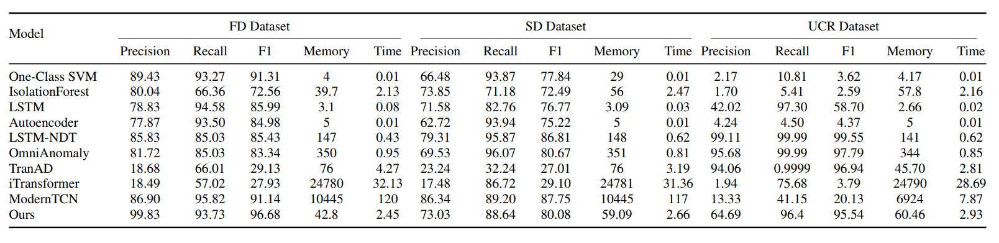

# ALPINE: Adaptive Lightweight Privacy-preserving INtelligence for Edge Crowdsensing

[](https://opensource.org/licenses/Apache-2.0)

This repository contains the implementation for our paper *"A Lightweight and Adaptive Privacy-decision Agent Framework for Dynamic Edge Crowdsensing"* (under review).

## Introduction
In **mobile edge crowdsensing (MECS) systems**, large-scale user-generated data is continuously collected and transmitted across dynamic, resource-constrained environments, posing significant privacy risks. Static privacy-preserving methods often fail to adapt to real-time threats. To address this, we propose **ALPINE**, **a lightweight and adaptive privacy-decision agent framework** that enables terminal devices to autonomously adjust differential privacy levels using a deep deterministic policy gradient (DDPG) algorithm.

_Page2_Image1.jpg>)
## Key Features
- 🛡️ **Adaptive Privacy Protection**: Dynamically adjusts differential privacy levels based on real-time risk assessment
- 🤖 **DDPG-based Control**: Uses deep reinforcement learning for optimal privacy-utility tradeoff
- 🌐 **Edge-Cloud Collaboration**: Implements closed-loop feedback between edge nodes and terminal devices
- ⚡ **Lightweight Deployment**: Designed for resource-constrained edge environments

## Installation
This code needs Python-3.11 or higher.
```bash
git clone https://github.com/your-repo/ALPINE.git
cd ALPINE
pip install -r requirements.txt
```

## Quickstart
### Training
To train a new Actor model, run:
```python
cd src/
python drl.py
```


### Evaluation
To run a model on a dataset, run the following command:
```python
python run.py
```

### Training Baseline Models
To train baseline models for channel risk anomaly detection:
```bash
cd baseline/script
sh <model>.sh  # where <model> is the baseline name (e.g. LSTM.sh, iTransformer.sh, etc.)
```

## Datasets
We use three types of datasets:
1. **Self-collected wireless channel datasets**:
   - `dataset/FD/`: Collected from a Raspberry Pi terminal, containing 24 hours of continuous network monitoring data
   - `dataset/SD/`: Collected from a laptop, recording 40 hours of network activity
   - Both include four types of simulated anomalies in test data:
     * Physical-layer signal anomalies
     * Network-layer transmission anomalies  
     * Hardware failures
     * Adversarial attacks

2. **Public datasets**:
   - `dataset/UCR/`: Public UCR time series dataset
   - `dataset/SensorData/`: Intel Lab sensor dataset

## Results

## Citation
If you use this code in your research, please cite our paper:
```bibtex
@inproceedings{alpine2025,
  title={A Lightweight and Adaptive Privacy-decision Agent Framework for Dynamic Edge Crowdsensing},
  author={Guanjie Cheng, Siyang Liu, Haoxiang Sui, Mengying Zhu, Xinkui Zhao, Yin Wang, Jianwei Yin, Shuiguang Deng},
  booktitle={Under Review},
  year={2025}
}
```

## License
This project is licensed under the Apache License 2.0 - see the [LICENSE](LICENSE) file for details.
